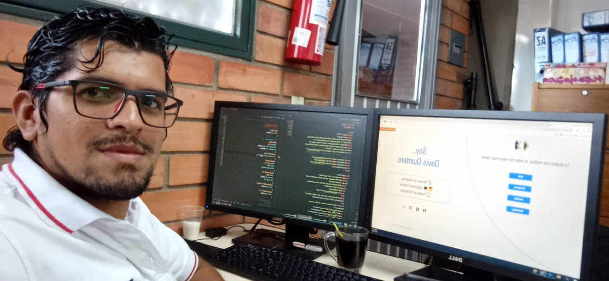

# 

 

## 👋 Hola

 

### Bienvenido al Repositorio de mi [Web Personal](https://davkintero.github.io/)

\
La Página Web esta hecha con:

1. Estructura HTML.
1. Hoja de Estilos en Cascada (CSS3).
   - Utilizo un mini Framework de mi autoría.
1. Interactividad con JavaScritp.
